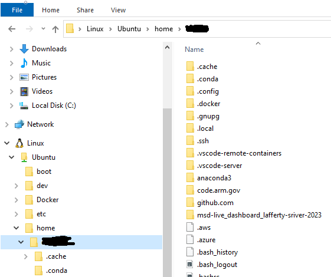

2.	Name server woes… I do a majority of my work NOT while on the VPN so I used google’s name server in step 2.6. but, if I’m on the VPN that results in an error whenever if something is trying to a curl/get/fetch, i.e. when I launched code from wsl for the first time using the workspace file I saw this in my console (2nd attempt after disconnecting from the VPN had no errors):
zoe@WE43187:~/msdlive/dev/msdlive-rdm-app$ code msdlive-rdm-app.code-workspace
Installing VS Code Server for x64 (2ccd690cbff1569e4a83d7c43d45101f817401dc)
Downloading: 100%
Failed
--2023-08-14 14:02:37--  https://update.code.visualstudio.com/commit:2ccd690cbff1569e4a83d7c43d45101f817401dc/server-linux-x64/stable
Resolving update.code.visualstudio.com (update.code.visualstudio.com)... failed: Temporary failure in name resolution.
wget: unable to resolve host address ‘update.code.visualstudio.com’
ERROR: Failed to download https://update.code.visualstudio.com/commit:2ccd690cbff1569e4a83d7c43d45101f817401dc/server-linux-x64/stable to /home/zoe/.vscode-server/bin/2ccd690cbff1569e4a83d7c43d45101f817401dc-1692046947.tar.gz


# Installing Docker on Windows Using WSL2, NOT Docker Desktop
These instructions help Windows users install Docker inside a WSL2 VM, without using 
Docker Desktop, which can be flaky when updating and has licensing fees.

## Prerequisite:  Uninstall Docker Desitop
If you have Docker Desktop currently installed, you will need to uninstall it first before
following the rest of the steps.

## Step 1.  Install WSL2
Install WSL2 following these instructions:  https://ubuntu.com/tutorials/install-ubuntu-on-wsl2-on-windows-10#1-overview

Per those instructions, I installed the Ubuntu terminal, which is a very nice to running
WSL through PowerShell.

## Step 2.  Fix your DNS settings in your WSL2 VM
By default, the VM will not have the correct name server configured, so you won't be able
to access any URLs until you fix this (i.e., you can't install anything in your VM yet).

Open a WSL2 terminal, and run this:

```
  echo -e "[network]\ngenerateResolvConf = false" | sudo tee -a /etc/wsl.conf
  sudo unlink /etc/resolv.conf
  echo nameserver 8.8.8.8 | sudo tee /etc/resolv.conf

  # If you are on the PNNL network, then use 130.20.248.22 instead of 8.8.8.8
```

This creates a file called /etc/wsl.conf and writes the echoed lines to it. It also removes the special settings
 on /etc/resolv.conf and sets a specific DNS for the network.

Restart WSL to make sure the DNS changes took effect:
* From a PowerShell terminal, run `wsl --shutdown`
* Open a new WSL terminal (from a PowerShell terminal, run `wsl`)
* From your WSL terminal, run `ping www.google.com`.  If you get a response, all is well.


## Step 3.  Install Docker in WSL2 VM
From a WSL terminal, run these commands.

1. Install Docker:
    ```
    curl -fsSL https://get.docker.com -o get-docker.sh
    sudo sh get-docker.sh
    ```

2. Add your user to the Docker group
    ```
    sudo usermod -aG docker $USER
    ```

3. Sanity check that both tools were installed successfully
    ```
    docker --version
    docker compose version
    ```

4. Fix your IP Tables

    If your WSL is using Ubuntu 22.04 or Debian 10+, you need to do 1 extra step for iptables
compatibility.  Choose option (1) to use iptables-legacy from
the prompt that'll come up when running the command below.

    You'll also likely need to restart WSL after applying
this, otherwise networking inside of your containers won't work.
    ```
    sudo update-alternatives --config iptables
    ```

    To figure out what version of Linux is running in WSL run this:
    ```
    cat /etc/os-release
    ```

5. Set your Docker daemon to run on starup

    From a WSL terminal, edit `/etc/wsl.conf`

    Add the following to the end of the file:
    ```
    [boot]
    systemd=true
    ```
6. Restart WSL

    From PowerShell terminal:
    ```
    wsl --shutdown
    wsl
    ```

7. Make sure systemd is running

    From your new WSL terminal, run
    ```
    systemctl list-unit-files --type=service
    ```

    If you see a bunch of services, all is well.  Hit `q` to exit.

8. Make sure Docker is running
    From your new WSL terminal, run
    ```
    ps aux | grep docker
    ```

    You should see that the docker daemon is running.  Something like:
    ``` 
    root         263  0.6  0.1 5284636 139760 ?      Ssl  Sep20 144:46 /usr/bin/dockerd -H fd:// --containerd=/run/containerd/containerd.sock
    ```

## Step 4. Move your code to WSL
All of your code has to be migrated under the WSL VM in order for you to use it.  
In Explorer, you can see it at the bottom under Linux/Ubuntu



Note that your WSL username is the one you set up when you installed WSL.  I picked my 
same windows username and password so I would remember.

You should symlink any config files or folders that currently exist in your Windows home folder
to your WLS home folder (e.g., ~/.ssh, ~/.aws, etc.) 

For example, to link your .ssh folder (known hosts and keys), from your WSL terminal, run:
```
ln -s /mnt/c/Users/$USER/.ssh ~/.ssh
```
